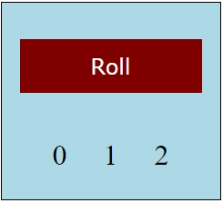

# Dice Roller

A simple dice roller application built using **HTML**, **CSS**, and **JavaScript**.

---

## How It Works

1. Click the "Roll" button.
2. The dice will roll, and a random number between 1 and 6 will be displayed.

---

## Features

- Displays random dice rolls (1-6).
- Clean and minimal interface.
- Responsive design for different screen sizes.

---

## Files in the Project

- **index.html**: Contains the structure of the app.
- **style.css**: Styles the dice roller UI.
- **script.js**: Implements the random number generation for the dice.

---

## How to Run

1. Open the `index.html` file in your browser.
2. Click "Roll" to roll the dice and generate random numbers.

---

## Screenshot

---

## Author

**Osama Khan**  
GitHub: [okhan02](https://github.com/okhan02)
